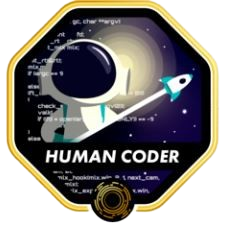

  <p align="center">  </p>

<h2 >Hi, I'm Nanda! </h2> 
 
<p><em>Graduated in software engineering at  
 <a href="https://www.42sp.org.br/">42 São Paulo </a>!</em></p>
 All projects developed during the course are available <a href="https://github.com/nandajfa/ft_cursus/blob/main/README.md">here </a>.


  [](https://github.com/nandajfa)
  [](mailto:nanda.jfa@gmail.com)
  [](https://www.linkedin.com/in/jessica-fernanda-programadora/)<br>


<hr>

  ####   A little more about me... 

```javascript
const nanda = {
   code: ["Javascript", "Typescript", "HTML", "CSS", "C", "C++"],

   tools: ["React", "Node", "NestJs", "Jest", "Docker", "Swagger"],

   languages: ["Portuguese(native)", "English(A2)", "Brazilian Sign language(fluent)"],

   curiosities: [🙌 "Working with handicraft", 📗 "Love reading books", 🎸 "Can play guitar"],

   challenge: "I am doing the #100DaysOfCode challenge focused on fullstack developer",

   Quote: "🤓 Always learning something new."

}
```

 <br>
  
  <div align="center">
  <a href="https://github.com/nandajfa" target="_blank">
  
  
     
 </div>

<br><br>
  <div align="center">


 
  </div>

  </div>


