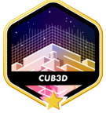

<h2 >Hello 👋</h2> 
 

<em>Software Engineering Student from <a href="https://www.42sp.org.br/">42 São Paulo</a></em>

  
  🙋‍♀️  About Me
   
  * 💻 I'm currently learning about C for the projects done at School 42.
  * 🤓 always learning something new
  * 🎵 love music
  * 🙌 Working with handicraft
  * 🤟 love brazilian sign language

  * 📚 reading a book
  
  
  

  ##    
  

  
  

 <h2>42's Projects Already Graded </h2>
 
PHASE 1

 

 
PHASE 2

 

  
 
  
  
 
 
  
  
<h3 align="center">Connect with me:</h3>
  
  
  
   
  
  
  <a href="https://github.com/nandajfa" target="_blank">
  
  

  
<h3 align="center">Languages and Tools:</h3>

   
   
  
   

 

  

  
  
  

